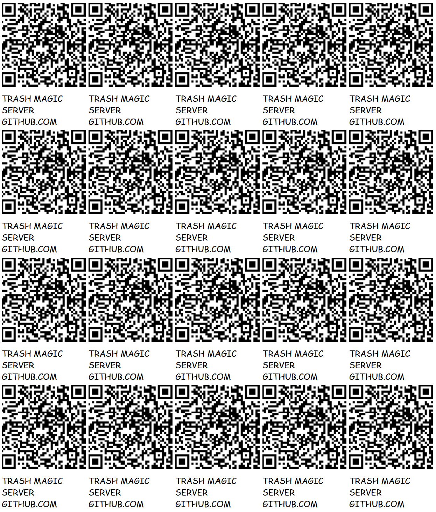

# [TRASH MAGIC SERVER](https://github.com/lafelabs/TRASH-MAGIC-SERVER)

TRASH MAGIC IS SELF-REPLICATING MEDIA ON THE [WORLD WIDE WEB](https://en.wikipedia.org/wiki/World_Wide_Web). SETS OF FILES REPLICATE FROM WEB SERVER TO WEB SERVER, SPREADING MEDIA AND THE TECHNOLOGY WHICH SUPPORTS THE MEDIA TOGETHER AS A UNIFIED WHOLE.  [PHP](https://en.wikipedia.org/wiki/PHP) SCRIPTS COMMUNICATE WITH THE SERVER SIDE FILE SYSTEM, [LOADING](php/load-file.txt), [SAVING](php/save-file.txt), [LISTING](php/list-files.txt), AND [DELETING](php/delete-file.txt)  FILES OF ALL KINDS, INCLUDING THE PHP SCRIPTS THEMSELVES. 

THE SET OF FILES CONTIANED HERE REPRESENTS A SELF-REPLICATING SET. THAT SET INLUDES THE PHYSICAL SERVERS, THE SOFTWARE WHICH RUNS ON THOSE SERVERS, THE PEOPLE WHO REPLICATE THE SERVERS, THE MEDIA WHICH TELLS PEOPLE HOW TO REPLICATE THE SERVERS, AND THE SOCIAL STRUCTURES WHICH SUPPORT REPLICATION.  WE TAKE "SET" TO BE AN ABSTRACT COLLECTION OF ELEMENTS IN THE MOST GENERAL MATHEMATICAL SENS HERE.  THAT IS TO SAY, TRASH MAGIC IS A MATHEMATICAL FRAMEWORK FOR INTERACTING WITH SELF-REPLICATING SETS OF WHICH WE ARE ELEMENTS!

A PHP [SCRIPT CALLLED generate-dna.php](php/generate-dna.txt) GENERATES A [JSON](https://en.wikipedia.org/wiki/JSON) FILE CALLED THE DNA([dna.txt](dna.txt)), WHICH LISTS ALL THE FILES IN THE SET.  THIS JSON FILE IS USED BY THE PHP SCRIPT [replicator.php](php/replictor.txt), WHICH USES THAT LIST OF FILES TO COPY THE WHOLE SET FROM SERVER TO SERVER USING ONLY CLIENT SIDE ACTIONS! 

VARIUS EDITOR APPLICATIONS EDIT EVERY ELEMENT OF THE SET OF FILES.  THE MAIN FILE [index.html](index.html) IS EDITED USING AN HTML EDITOR [edit-index.html](edit-index.html), THE WHOLE SET OF FILES IN THE MAIN FOLDER ARE EDITED USING [edit-html.html](edit-html.html), AND THE PHP FILES ARE EDITED IN THE [php/](php/) FOLDER WITH [edit-php.html](edit-php.html).

TRASH MAGIC SERVERS ARE USED TO SPREAD FREE MEDIA ON FREE SOFTWARE THAT RUNS ON FREE HARDWARE VIA THE PHYSICAL NETWORKS OF THE WORLD. WE TAKE OLD COMPUTERS MADE USELESS BY THE PLANNED OBSOLESCENCE OF BIG TECH AND PUT FREE SOFTWARE ON THEM WHICH BOTH CREATES AND SHARES MEDIA ON LOCAL NETWORKS. WE THEN DISRIBUTE THESE SERVERS FROM CARTS ALONG THE STREETS AND HIGHWAYS AND TRASNSIT LINES OF THE WORLD.  

THIS IS A PHYSICAL NETWORK OF FREE MEDIA DISTRIBUTION USING SELF-REPLICATING CODE.

## LANGUAGE ELEMENTS OF TRASH MAGIC SERVERS

 - [HTML](https://en.wikipedia.org/wiki/HTML)
 - [PHP](https://en.wikipedia.org/wiki/PHP)
 - [JAVASCRIPT](https://en.wikipedia.org/wiki/JavaScript)
 - [CSS](https://en.wikipedia.org/wiki/CSS)
 - [JSON](https://en.wikipedia.org/wiki/JSON)
 - [MARKDOWN](https://en.wikipedia.org/wiki/Markdown)

## OPERATING SYSTEM ELEMENTS OF TRASH MAGIC SERVERS

 - [UBUNTU STUDIO FREE MEDIA OPERATING SYSTEM](https://ubuntustudio.org/)
 - [XAMPP LOCAL PRIVATE WEB SERVER SOFTWARE](https://www.apachefriends.org/)
 - [CLOUD HOSTING AT EASYDNS.COM](https://easydns.com/)
 - [LOCAL SERVERS ON ANDROID WITH KSWEB](https://play.google.com/store/apps/details?id=ru.kslabs.ksweb&hl=en_US)
 - [RASPBERRY PI SERVERS](https://www.raspberrypi.com/)
 - [APACHE WEB SERVER](https://www.apache.org/)

## LIVE LINKS OF TRASH MAGIC ON LOCAL INSTANCES

 - [index.html](index.html)
 - [qrcode.html](qrcode.html)
 - [edit-html.html](edit-html.html)
 
## PHYSICAL ELEMENTS OF SERVER NETWORK

 - BOOK SHOPS
 - STREETS/HIGHWAYS
 - PUBLIC TRANSIT NETWORKS
 - LIBRARIES
 - SHOPPING CARTS
 - CARDBOARD SIGNS
 - MOBILE SOLAR POWER STATIONS
 - TRASH MAGICIANS
 - TEXTILE HYPERLINKS(BLACK FLAGS)
 - PRINTED QR CODES
 - URLS WRITTEN ON TRASH WITH MARKER OR PAINT PEN

## HTML AND TEXT FILES:

  - [README.md](README.md)
  - [album.html](album.html)
  - [branch.html](branch.html)
  - [delete-html.html](delete-html.html)
  - [delete-php.html](delete-php.html)
  - [dna.txt](dna.txt)
  - [edit-html.html](edit-html.html)
  - [edit-index.html](edit-index.html)
  - [edit-php.html](edit-php.html)
  - [edit-qrcode-list.html](edit-qrcode-list.html)
  - [freebox.html](freebox.html)
  - [geometron-squares.html](geometron-squares.html)
  - [geometron.js](geometron.js)
  - [index.html](index.html)
  - [qrcode-list.html](qrcode-list.html)
  - [qrcode-list.txt](qrcode-list.txt)
  - [qrcode-page.html](qrcode-page.html)
  - [qrcode.html](qrcode.html)
  - [readme.html](readme.html)
  - [squares.html](squares.html)
  - [trash-magic.html](trash-magic.html)
  - [trashmagic.css](trashmagic.css)
  - [trashmagic.js](trashmagic.js)
  - [wall.txt](wall.txt)

## PHP CODE AS RAW TEXT:

  - [php/branch.txt](php/branch.txt)
  - [php/compile-php.txt](php/compile-php.txt)
  - [php/delete-branch.txt](php/delete-branch.txt)
  - [php/delete-file.txt](php/delete-file.txt)
  - [php/generate-dna.txt](php/generate-dna.txt)
  - [php/list-branches.txt](php/list-branches.txt)
  - [php/list-files.txt](php/list-files.txt)
  - [php/load-file.txt](php/load-file.txt)
  - [php/local-replicator.txt](php/local-replicator.txt)
  - [php/replicator.txt](php/replicator.txt)
  - [php/save-file.txt](php/save-file.txt)
  - [php/save-png.txt](php/save-png.txt)
  - [php/upload-image.txt](php/upload-image.txt)