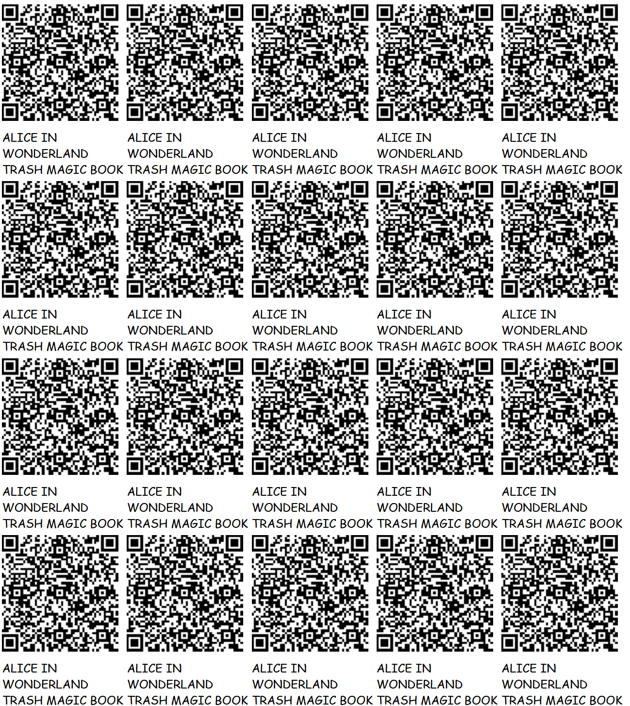

# [Alice in Wonderland](https://github.com/LafeLabs/TRASH-MAGIC-SERVER/tree/main/alice-in-wonderland/)




 - [localhost/TRASH-MAGIC-SERVER/alice-in-wonderland/](http://localhost/TRASH-MAGIC-SERVER/alice-in-wonderland/)
 - [index.html](index.html)
 - [edit-html.html](edit-html.html)
 - [edit-book.html](edit-book.html)
 - [edit-php.html](edit-php.html)
 - [qrcode.html](qrcode.html)
 - [global replicator link](https://raw.githubusercontent.com/LafeLabs/TRASH-MAGIC-SERVER/refs/heads/main/alice-in-wonderland/php/replicator.txt)

Self-relicacating book

```
copy-book.php?book=[global url of this server]/book.txt
```